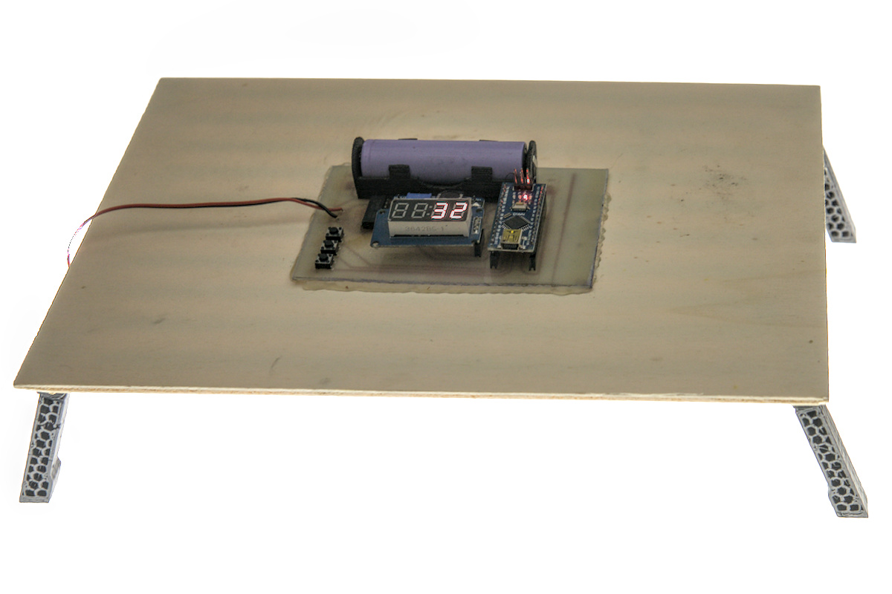

# Exposer

Exposure timer for PCB production. 
Can be also used for screen printing or other analog printing techniques.
Quickly knocked together using parts I had laying around.

Pictures are of a previous generation.




## Parts list

TODO: write down particular parts used

- Arduino Nano
- ULN2003 or similar darlington transistor array
- TM1637 4 Digit 7-Segment LED
- 18650 cell with leads or 18650 holder
- Encoder with button
- Switch
- UV LED strip

## Dependency

TM1637Display library is used for driving seven-segment display.
It's the one that comes with Arduino IDE.

https://github.com/avishorp/TM1637

## PCB

The board is one-sided to allow easy fabrication at home.
KiCad project is in ```exposer_pcb```.
Neagtive artwork is in PDF format, but it's better to open the KiCad project for soldering.

## Assembly

3d-print every model once, except the legs, you need four of them.
Put the LED-strips into holding pockets, solder them together and to longer power-in cable.  
Fix the legs with 4mm screws or however you like.
Assemble the PCB.
Don't forget to set the correct voltage on boost converter.
Connect the LEDs to the board and you are ready to go.

## Customizing

You can change the 3d-model even if you don't really know OpenSCAD language.
OpenSCAD has customizer module, in which you can graphically change the parameters.
You can use longer LED strips or more of them.

## Usage

Rotating the encoder changes exposure in relative EV units.
Display shows time in seconds, or denominator of a fraction of a second.
It ```:``` symbol is present on display, it's fraction, if not - whole seconds.
Every step divides or multiplies the exposure time.
Pressing the encoder starts exposure and shows countdown.

